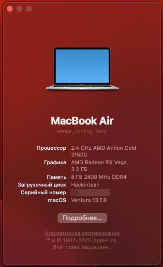

  

## Hardware

<table>
    <tr>
      <td>MacOS</td>
      <td>Ventura 13.7.8</td>
    </tr>
    <tr>
      <td>Laptop</td>
      <td>HP 15-gw0040ur</td>
    </tr>
    <tr>
      <td>CPU</td>
      <td>AMD Athlon Gold 3150u, 2 Cores 4 Threads, Picasso, Zen+</td>
    </tr>
    <tr>
      <td>Graphics 1 (iGPU)</td>
      <td>Vega 3</td>
    </tr>
    <tr>
      <td>Graphics 2 (dGPU - Disabled)</td>
      <td>Radeon 620</td>
    </tr>
    <tr>
      <td>RAM</td>
      <td>8GB Samsung 4x2 2400Mhz</td>
    </tr>
    <tr>
      <td>SSD</td>
      <td>Kioxia NVME 256Gb</td>
    </tr>
    <tr>
     <td>Touchpad</td>
     <td>ELAN072B</td>
    </tr>
    <tr>
      <td>WiFi & Bluetooth (internal, disabled)</td>
      <td>RTL8821CE</td>
    </tr>
    <tr>
      <td>WiFi (external, with <a href="https://github.com/chris1111/Wireless-USB-OC-Big-Sur-Adapter">chris1111 drivers</a>)</td>
      <td>RTL8821CU</td>
    </tr>
</table>

## Working (tested)

- [x] Audio
- [x] iGPU 
- [x] Brightness
- [x] Keyboard with Volume & Brightness controls 
- [x] Touchpad with multitouch gestures
- [x] Shutdown, restart
- [x] 2x USB-A & 1x USB-C
- [x] HDMI
- [x] Camera
- [x] WiFi (adapter)

## Does not work 

- [ ] Internal Wifi & Bluetooth
- [ ] dGPU
- [ ] Sleep & wake (yet)
- [ ] Touch to tap gesture (yet)
- [ ] Battery percentage (yet)

## Not tested

- [ ] FileVault
- [ ] AirDrop, iMessage, AirPlay, FaceTime etc.
